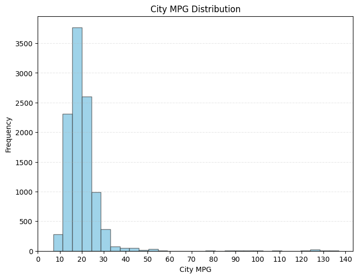
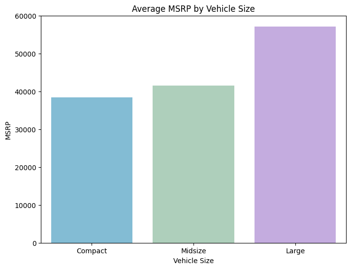
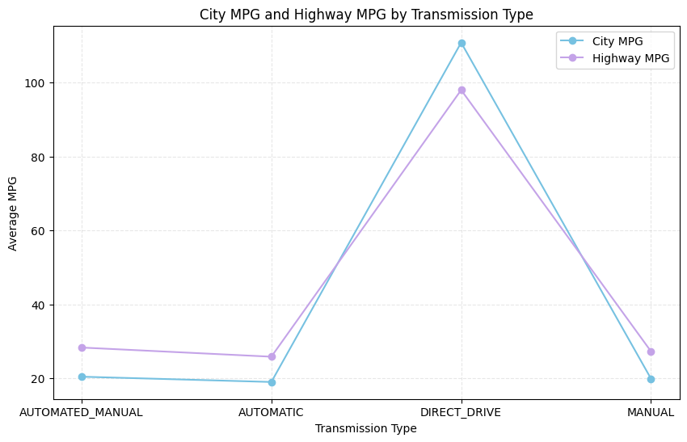

# Car Data Analysis

## Project Overview
This project analyzes a dataset of **11,914 car listings with 16 features**.  
The goal is to clean the data, engineer new features, perform exploratory data analysis (EDA), and create visualizations to uncover meaningful insights about pricing, performance, efficiency, and popularity.

## Objectives
- Import and explore the dataset
- Clean and preprocess data (handling missing values, correcting errors)
- Engineer new features (e.g., Total MPG)
- Perform descriptive statistics and group analysis
- Visualize key relationships between car attributes
- Identify correlations and market trends

## Tech Stack
- Python  
- Libraries: Pandas, NumPy, Matplotlib, Seaborn  
- Jupyter Notebook

## Key Insights
- **Engine HP**: ranges from 55 to 1001 HP, with a skewed distribution driven by high-performance cars.  
- **MSRP**: spans from $2,000 to over $2M, median around $31k, showing strong skew due to luxury/exotic models.  
- **Fuel Efficiency**: electric vehicles stand out with extremely high MPG values, while most cars cluster around 15–25 MPG.  
- **Driven Wheels**: rear/all-wheel drive cars are more expensive, front-wheel drive cars are cheaper.  
- **Vehicle Size**: larger cars are both more popular and more expensive.  
- **Correlation Analysis**: Engine HP correlates positively with MSRP (0.65), negatively with MPG; City and Highway MPG strongly correlate (0.94). Popularity shows no meaningful linear relationship.

## Repository Structure
- `notebooks/` -> Jupyter notebooks with analysis  
- `data/` -> sample dataset + link to source  
- `images/` -> charts and visualizations  
- `requirements.txt` -> list of dependencies  

## How to Run
1. Clone the repository  
   ```bash
   git clone https://github.com/MapiAI/car-data-analysis.git
   
3. Install requirements
   pip install -r requirements.txt
   
4. Open the notebook
   jupyter notebook notebooks/car_data_analysis.ipynb

## Visuals

* This pattern suggests that the dataset reflects the real-world market, where most cars have moderate fuel efficiency, and high efficiency vehicles are relatively rare.



* The bar plot shows a clear difference in market price between large vehicles and the other two vehicle sizes.

  

* Overall, the plot highlights a tight cluster for traditional transmissions and a clear outlier formed by electric vehicles.

For the complete set of visualizations, please refer to the [Car Data Analysis Notebook](notebooks/CarAnalysisProject.ipynb).
  

## Next Steps
- Extend analysis with machine learning models (e.g., car price prediction)

- Publish interactive dashboard in Tableau

## License
This project is licensed under the MIT License – free to use, modify, and share with attribution.
   
